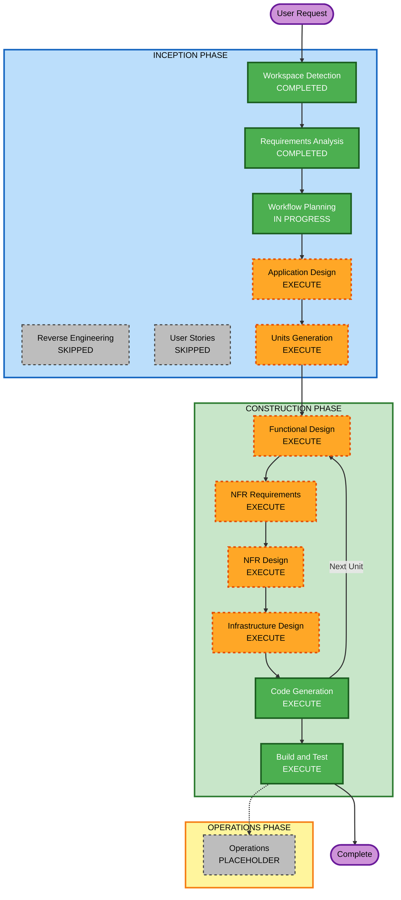

# Execution Plan — Ideation Portal

## Detailed Analysis Summary

### Change Impact Assessment
- **User-facing changes**: Yes — full new application with submission UI, evaluation UI, dashboards, leaderboards, recognition
- **Structural changes**: Yes — new system architecture (serverless, event-driven, multi-role)
- **Data model changes**: Yes — new DynamoDB tables for users, ideas, campaigns, evaluations, notifications
- **API changes**: Yes — new REST API via API Gateway + Lambda
- **NFR impact**: Yes — serverless scalability, blind scoring enforcement, async event processing, performance targets

### Risk Assessment
- **Risk Level**: Medium-High (new system, multiple domains, async workflows, role-based security)
- **Rollback Complexity**: Easy (greenfield — nothing to roll back to)
- **Testing Complexity**: Complex (multi-role, blind scoring logic, async event flows, aggregation)

---

## Workflow Visualization

### Text Representation (Canonical)

```
INCEPTION PHASE
  [x] Workspace Detection          - COMPLETED
  [ ] Reverse Engineering          - SKIPPED (Greenfield)
  [x] Requirements Analysis        - COMPLETED
  [ ] User Stories                 - SKIPPED (requirements clear, user approved skip)
  [x] Workflow Planning            - IN PROGRESS
  [ ] Application Design           - EXECUTE
  [ ] Units Generation             - EXECUTE

CONSTRUCTION PHASE (per unit)
  [ ] Functional Design            - EXECUTE
  [ ] NFR Requirements             - EXECUTE
  [ ] NFR Design                   - EXECUTE
  [ ] Infrastructure Design        - EXECUTE
  [ ] Code Generation              - EXECUTE (ALWAYS)
  [ ] Build and Test               - EXECUTE (ALWAYS)

OPERATIONS PHASE
  [ ] Operations                   - PLACEHOLDER
```

### Mermaid Diagram



---

## Phases to Execute

### INCEPTION PHASE
- [x] Workspace Detection — COMPLETED
- [x] Reverse Engineering — SKIPPED (Greenfield, no existing code)
- [x] Requirements Analysis — COMPLETED
- [ ] User Stories — SKIPPED
  - **Rationale**: Requirements are detailed and clear. User approved skipping. No ambiguity requiring story-level clarification.
- [x] Workflow Planning — IN PROGRESS
- [ ] Application Design — EXECUTE
  - **Rationale**: New system with multiple new services (User Service, Idea Service, Campaign Service, Evaluation Service, Notification Service, Analytics Service, Recognition Service). Component boundaries, methods, and service interactions need definition before code generation.
- [ ] Units Generation — EXECUTE
  - **Rationale**: Multiple independent domains can be developed as separate units of work, enabling structured parallel development and clear code generation scope per unit.

### CONSTRUCTION PHASE (per unit)
- [ ] Functional Design — EXECUTE
  - **Rationale**: Complex business logic including blind scoring enforcement, score aggregation algorithm, campaign lifecycle state machine, draft auto-save, and recognition workflow require detailed design.
- [ ] NFR Requirements — EXECUTE
  - **Rationale**: Serverless tech stack (Lambda, DynamoDB, Cognito, EventBridge, S3, CloudFront) needs explicit NFR mapping. Performance targets (2s API, 5s dashboard refresh) and scalability (500–5,000 users) need design decisions.
- [ ] NFR Design — EXECUTE
  - **Rationale**: NFR patterns need incorporation: DynamoDB access patterns, Lambda cold start mitigation, EventBridge event schema design, Cognito JWT validation middleware, S3 pre-signed URL patterns.
- [ ] Infrastructure Design — EXECUTE
  - **Rationale**: Full AWS SAM template.yaml needs specification covering all Lambda functions, API Gateway routes, DynamoDB tables, Cognito User Pool, EventBridge rules, S3 buckets, CloudFront distribution, and IAM roles.
- [ ] Code Generation — EXECUTE (ALWAYS)
  - **Rationale**: Implementation of all units.
- [ ] Build and Test — EXECUTE (ALWAYS)
  - **Rationale**: Build, test, and verification instructions for all units.

### OPERATIONS PHASE
- [ ] Operations — PLACEHOLDER
  - **Rationale**: Future deployment and monitoring workflows not yet defined.

---

## Estimated Units of Work (Preliminary)

The following units are anticipated from Application Design + Units Generation:

| Unit | Domain | Key Scope |
|---|---|---|
| Unit 1 | Infrastructure & Auth | SAM template, Cognito, API Gateway, shared middleware |
| Unit 2 | User & Campaign Management | User CRUD, role assignment, campaign lifecycle |
| Unit 3 | Idea Submission | Idea form, draft saving, category tagging, file upload |
| Unit 4 | Evaluation Engine | Blind scoring, score aggregation, evaluation workflow |
| Unit 5 | Dashboards & Leaderboard | Real-time leaderboard, multi-dimensional views |
| Unit 6 | Analytics | Top ideas, comparative analysis, participation metrics |
| Unit 7 | Notifications & Recognition | In-portal notifications, top-3 recognition, admin alerts |

*Final units will be confirmed after Application Design and Units Generation stages.*

---

## Success Criteria
- **Primary Goal**: Fully functional Ideation Portal deployed on AWS (serverless)
- **Key Deliverables**: React SPA, Lambda API, DynamoDB schema, SAM template.yaml, async event flows
- **Quality Gates**: Blind scoring enforced server-side, RBAC on all endpoints, leaderboard accuracy, recognition workflow triggered correctly
